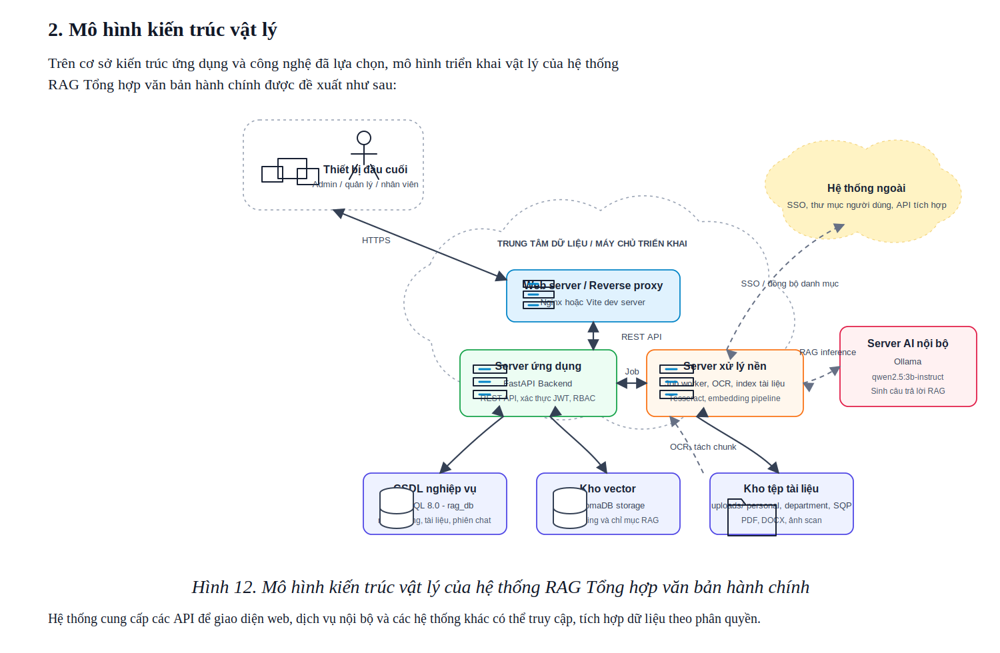

# 2. Mô hình kiến trúc vật lý

Trên cơ sở kiến trúc ứng dụng và công nghệ đã được lựa chọn, mô hình kiến trúc vật lý của hệ thống RAG Tổng hợp văn bản hành chính được triển khai theo mô hình web tập trung. Người dùng thuộc các vai trò quản trị viên, quản lý và nhân viên truy cập hệ thống thông qua trình duyệt trên máy tính hoặc thiết bị di động. Các yêu cầu được gửi qua mạng LAN/Internet tới web server hoặc reverse proxy, sau đó chuyển tiếp đến backend FastAPI để xử lý nghiệp vụ.

*Hình 12. Mô hình kiến trúc vật lý của hệ thống RAG Tổng hợp văn bản hành chính*

Trong cụm máy chủ triển khai, server ứng dụng đảm nhiệm cung cấp REST API, xác thực JWT, phân quyền RBAC và điều phối các nghiệp vụ quản lý tài liệu, phiên chat, người dùng, phòng ban và đề xuất SQP. Server xử lý nền thực hiện các tác vụ có thời gian chạy dài như OCR, tách nội dung tài liệu, tạo embedding và cập nhật chỉ mục vector.

Dữ liệu nghiệp vụ của hệ thống được lưu trong MySQL, bao gồm tài khoản người dùng, phân quyền, phòng ban, tài liệu, phiên hội thoại và lịch sử xử lý. Các tệp tài liệu gốc được lưu tại kho tệp của hệ thống theo các vùng personal, department và SQP. Dữ liệu embedding phục vụ truy vấn RAG được lưu trong ChromaDB. Khi người dùng đặt câu hỏi, backend truy vấn ChromaDB để lấy ngữ cảnh liên quan, sau đó gọi server AI nội bộ Ollama để sinh câu trả lời.

Hệ thống cũng có khả năng tích hợp với các hệ thống bên ngoài như SSO, danh mục người dùng/phòng ban hoặc các API nghiệp vụ khác. Các kết nối tích hợp này được thực hiện thông qua API có kiểm soát quyền truy cập, giúp đảm bảo an toàn dữ liệu và khả năng mở rộng khi triển khai trong môi trường thực tế.
